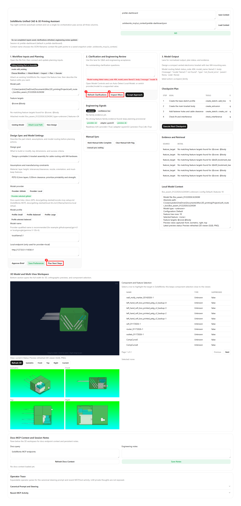
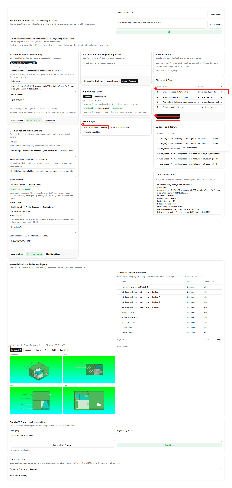
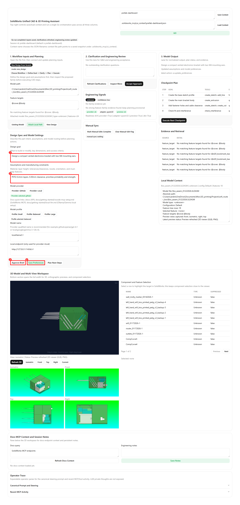
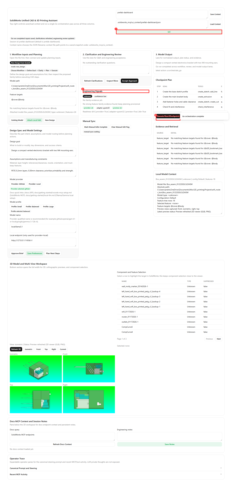

# Prefab UI Dashboard

An interactive CAD design assistant with real-time SolidWorks integration. Click buttons to call GitHub Copilot for design planning, execute checkpoints, and sync the 3D viewport.

For a complete control-by-control mapping (every button/input to endpoint/service), see `docs/getting-started/prefab-ui-controls-reference.md`.

## Features

- **Design Intent Pane** (wider left side): Edit goals, ask clarifying questions, classify the design family
- **Target Model Pane**: Attach a concrete `.sldprt`/`.sldasm` path and grounded feature targets such as `@Boss-Extrude1`
- **Assumptions + Model Controls**: Persist provider/profile/local endpoint choices for `pydantic-ai`
- **Checkpoint Queue** (middle): Reviewable workflow steps with one-click execution (adapter-backed for supported tools)
- **3D Model View** (larger right pane): Real-time PNG preview synced every ~3 min or manual refresh with orientation buttons (Isometric/Front/Top/Current)
- **Manual Sync Detection**: Capture before/after snapshots and detect manual edits
- **Evidence Retrieval**: Track LLM sources and design decisions
- **Context Window Monitor**: Track token usage (cosmetic currently)

## Layout

The dashboard uses an 8-column responsive grid:

- **Left (3 cols)**: Design intent + family classification gate
- **Left (3 cols)**: Design intent + target model + assumptions/model controls + BYO references + family checkpoint
- **Middle (3 cols)**: Checkpoint queue + context window + evidence table + manual sync
- **Right (2 cols)**: 3D model view pane with orientation controls

## Workflow modes

Use one of these workflows depending on how much UI you want:

### MCP server only

- Start the MCP server and drive everything from chat or tool calls.
- Best when you already know the exact tool sequence.
- Recommended for scripted tests and low-level debugging.

### UI workflow

- Start the FastAPI backend plus Prefab dashboard.
- Attach a target model, inspect, plan, and execute from the UI.
- Best for guided, human-in-the-loop editing and provenance review.

### Hybrid workflow

- Use the UI to ground intent, attach the active model, and inspect evidence.
- Use MCP/chat for specialized operations or direct tool invocation.
- Return to the UI for preview refresh, manual sync, and checkpoint review.

## Control reference

Use `docs/getting-started/prefab-ui-controls-reference.md` as the authoritative map for:

- every textbox/button/row click action in the dashboard
- expected visual feedback after each action
- backend endpoints and service functions hit by each control
- controls that are implemented in backend but not currently surfaced in the dashboard

## Design Spec and Model Settings: what to enter

This card controls how planning prompts are formed and which model provider handles Clarify/Inspect/Go actions.

- Design goal textbox:
  - Enter the target outcome in one concise paragraph.
  - Include what should be created or changed, critical dimensions, and what "done" means.
  - Example: "Design a vented electronics bracket with two M4 mounting ears and >=2.5 mm wall thickness."
- Assumptions textbox:
  - Enter manufacturing assumptions and constraints.
  - Include material, layer height, nozzle size, clearance/tolerance targets, print orientation, and any keep-out constraints.
  - Example: "PETG, 0.2 mm layers, 0.4 mm nozzle, 0.30 mm mating clearance, avoid >45 degree unsupported overhangs."
- Provider buttons:
  - `Provider: GitHub` routes structured planning calls to GitHub Models.
  - `Provider: Local` routes structured planning calls to your local OpenAI-compatible endpoint (for example Ollama).
- Profile buttons:
  - `Small` / `Balanced` / `Large` tune the default model recommendation and latency/quality tradeoff.
- Model name textbox:
  - Use provider-qualified names when possible.
  - Examples: `github:openai/gpt-4.1`, `local:google/gemma-3-12b-it`.
- Local endpoint textbox:
  - Only used when provider is local.
  - Typical value: `http://127.0.0.1:11434/v1`.

Setup references:

- SolidWorks MCP setup in VS Code: [getting-started/vscode-mcp-setup.md](vscode-mcp-setup.md)
- Local Ollama/Gemma setup: [getting-started/local-llm.md](local-llm.md)
- Backend API/OpenAPI docs when running locally: <http://127.0.0.1:8766/docs>

## What the preview pane does and doesn't do

**Current approach (PNG export)**:

- Asks the backend to call `export_image(view_orientation=...)` from the active SolidWorks adapter
- Serves the PNG into the dashboard with Isometric/Front/Top/Current orientation buttons
- Refreshes manually or on a timer every 3 minutes

**Future work** (not yet implemented):

- 3D viewport streaming with real-time camera sync
- STL export alongside PNG for richer 3D representation on sketches

## Install UI dependencies

From the repo root:

```powershell
.\.venv\Scripts\python.exe -m pip install -e ".[ui]"
```

## Start the backend

Run the local JSON backend first:

```powershell
.\.venv\Scripts\python.exe -m uvicorn solidworks_mcp.ui.server:app --host 127.0.0.1 --port 8766 --reload
```

The backend exposes state, planning, preview, target-model, and retrieval-ingestion endpoints that correspond to the dashboard cards.

The backend is implemented with FastAPI, so local endpoint docs are available at <http://127.0.0.1:8766/docs>.

## Start the Prefab frontend

In a **second terminal**:

```powershell
.\.venv\Scripts\prefab.exe serve src/solidworks_mcp/ui/prefab_dashboard.py
```

The frontend will connect to `http://127.0.0.1:8766` by default.

You can override the API origin:

```powershell
$env:SOLIDWORKS_UI_API_ORIGIN = "http://localhost:8766"
.\.venv\Scripts\prefab.exe serve src/solidworks_mcp/ui/prefab_dashboard.py
```

**Legacy launch path** (still works):

```powershell
.\.venv\Scripts\prefab.exe serve examples/prefab_cad_assistant/cad_assistant_dashboard.py
```

## LLM button requirements

The **Clarify** and **Inspect** buttons use GitHub Copilot (openai/gpt-4.1) via PydanticAI.

You must provide **one** of:

- `GH_TOKEN` environment variable
- `GITHUB_API_KEY` environment variable with models:read scope
- an authenticated `gh auth login` session (the backend queries `gh auth token` as fallback)

**Override the model** if needed:

```powershell
$env:SOLIDWORKS_UI_MODEL = "github:openai/gpt-4.1"
.\.venv\Scripts\python.exe -m uvicorn solidworks_mcp.ui.server:app --host 127.0.0.1 --port 8766
```

**Local open-weight routing**:

1. Save assumptions/model settings in the UI with:
   - provider = `local`
   - profile = `small` / `balanced` / `large`
   - model name = for example `local:google/gemma-3-12b-it`
   - local endpoint = for example `http://127.0.0.1:11434/v1`
2. Clarify/Inspect actions will route through `OpenAIProvider(base_url=...)` against the configured local endpoint.

## Preview pane requirements

For the 3D view pane to sync:

1. **SolidWorks running** with an active part or assembly
2. **Valid adapter** (pywin32 adapter on Windows with COM support)
3. **Model file** in memory (not needed at startup, but required for export_image to work)

The dashboard now attempts to reopen the attached target model before preview export. In practice, the most reliable flow is:

1. Attach the target model path in the UI.
2. Confirm SolidWorks opened it successfully.
3. Click `Refresh 3D View`.

## Working on a saved model

If you already have a part such as:

```text
C:\Users\andre\OneDrive\Documents\GitHub\SolidworksMCP-python\.generated\part_1.sldprt
```

use the UI like this:

1. Paste that path into `Target Model`.
2. Optionally add a grounded feature target, for example `@Boss-Extrude1` or `@Sketch1`.
3. Click `Attach Model and Inspect`.
4. Review the detected family, feature-target grounding status, and preview pane.
5. Then click `Go: Plan Next Steps` to ask the planner how to extend the existing model.

That is how you tell the model, in a grounded way, which SolidWorks file it should operate on and which feature region it should focus on.

## BYO retrieval ingestion

The current scaffold is path-based rather than browser-upload based:

1. Paste the absolute path to a PDF, markdown, or text reference source.
2. Enter a namespace such as `box-howto` or `machinery-book-ch2`.
3. Click `Ingest Reference Source`.
4. The backend writes a simple local JSON retrieval index under `.solidworks_mcp/rag/` and stores provenance in session state.

This is intentionally copyright-safe: only user-provided files are ingested.

Preview images are stored in: `.solidworks_mcp/ui_previews/`

The pane auto-refreshes every 3 minutes (SetInterval 180000ms) or on manual click.

## Button integration status

### ✅ Fully Hooked Up + Working

- **Approve Brief**: Saves goal → SQLite session
- **Attach Model and Inspect**: Opens a target SolidWorks file, inspects features, validates feature-target refs, and seeds family evidence
- **Ask Clarifying Questions**: Calls GitHub Copilot → returns normalized brief + Q&A
- **Inspect More**: Calls GitHub Copilot → returns family, confidence, evidence, warnings, checkpoints
- **Ingest Reference Source**: Builds a simple retrieval JSON index from a local PDF/text source
- **Accept Family**: Updates session → persists family choice
- **Execute Next Checkpoint**: Runs supported adapter tools (`create_sketch`, `add_line`, `create_extrusion`, `create_cut`/`create_cut_extrude`) and logs each tool result
- **Refresh 3D View**: Calls `export_image()` → PNG → preview pane; supports Isometric/Front/Top/Current
- **Run Diff + Reconcile**: Compares snapshots → reports manual changes
+.3+-*- **Approve Brief**: Explicitly accepts the current design goal into the session brief

### 🔧 MOCKED (Clearly Marked In App + Code)

- **`check_interference` checkpoint tool**: Marked as `MOCKED` in checkpoint tool results until tool-layer wiring is added
- **Live 3D viewport streaming / STL embedding in UI**: Marked as `MOCKED` in the 3D pane; current implementation uses PNG export refresh
  
### 📋 Implemented In Backend, Not Currently Surfaced In This Dashboard

- `POST /api/ui/rag/ingest` (BYO ingestion route exists but no dedicated dashboard button at present)
- `GET /api/ui/debug/session` (debug endpoint)
- `POST /api/ui/local-model/pull` and `POST /api/ui/local-model/query` (local model ops)

### 📋 Planned or Partial

- Tool-layer `check_interference` execution from checkpoint runner
- Enrich model state capture (currently snapshot-first)
- Real-time viewport streaming (would need viewport API exposure)

## Architecture notes

**Backend** (`src/solidworks_mcp/ui/server.py`):

- FastAPI app with typed request models, CORS middleware, and built-in OpenAPI docs
- State, planning, target-model, retrieval-ingestion, preview, and manual-sync endpoints + static file serving for preview images
- All async for LLM calls

**Service** (`src/solidworks_mcp/ui/service.py`):

- State management via SQLite (session + checkpoints + evidence + snapshots)
- LLM integration via `_run_structured_agent()` with PydanticAI
- Adapter factory for SolidWorks COM calls (export_image, etc.)

**Dashboard** (`src/solidworks_mcp/ui/prefab_dashboard.py`):

- Prefab UI framework with reactive state binding
- Fetch actions for all buttons
- SetInterval timers for auto-refresh (3 min) and context animation (500ms)

## Troubleshooting

**Preview pane shows "No preview captured yet"**:

- Attach a target model first, then click `Refresh 3D View`
- Confirm the configured adapter is `pywin32` rather than `mock`
- Check that SolidWorks COM is available: `.venv\Scripts\python.exe -c "import pywin32_loader; from win32com.client import GetObject; print(GetObject(Class='SldWorks.Application'))"`

**LLM buttons fail with auth error**:

- Verify `gh auth login` or set `GH_TOKEN`: `.venv\Scripts\python.exe -c "import os; print(os.getenv('GH_TOKEN', 'NOT SET'))"`
- If using GitHub Models for the first time, ensure your gh CLI session has models:read scope

**Checkpoint execution partially mocked**:

- Most checkpoint tools run through the adapter now.
- If a tool has no adapter binding (for example `check_interference`), the app marks it `MOCKED` in the queue details and keeps the message explicit.

**Feature target did not ground**:

- Use the exact feature-tree name, for example `@Boss-Extrude1`
- Re-attach the model after changing feature targets so the UI can revalidate them against the active tree

**PDF ingestion failed**:

- Use a text or markdown file first, or install `pypdf` in the environment before ingesting PDF sources

## Next steps

1. **Start both services** as shown above in separate terminals
2. **Attach your target model** and optionally a feature target like `@Boss-Extrude1`
3. **Edit the design goal** and click `Approve Brief`
4. **Optionally ingest a how-to or book excerpt** into a retrieval namespace
5. **Click `Ask Clarifying Questions`** to see normalization
6. **Click `Go: Plan Next Steps` or `Inspect More`** to classify the current model and generate checkpoints
7. **Accept Family** once you're happy with the classification
8. **Refresh 3D View** to see the current SolidWorks viewport
9. **Use orientation buttons** to switch between Isometric/Front/Top/Current views

## Demo: run an example part flow

Use this as a repeatable demo scenario:

1. Start backend and Prefab UI as described above.
2. In lane 1, paste a model path such as:

```text
C:\Users\andre\OneDrive\Documents\GitHub\SolidworksMCP-python\.generated\part_1.sldprt
```

1. Enter feature targets (optional), for example `@Boss-Extrude1`.
2. Click **Attach Local Path**.
3. Click **Refresh 3D** and then **Isometric** / **Front** / **Top**.
4. Click **Plan Next Steps**, then **Accept Approach**.
5. Click **Execute Next Checkpoint** and review checkpoint status changes.
6. In the feature table, click one row and confirm viewer/selection update.
7. Save context with name `prefab-dashboard`, then load it back to confirm round-trip persistence.

If `.generated\part_1.sldprt` is not present in your local workspace, use any existing `.sldprt`/`.sldasm` path you already open in SolidWorks (cupcake).

## Walkthroughs With Screenshot Callouts

Use these two guided walkthroughs when documenting demos or onboarding users.
For each step:

1. Capture a screenshot.
2. Add numbered callout boxes around the referenced controls.
3. Validate the expected state update below the screenshot.

### Walkthrough A: Update an Existing Part/Assembly

#### Step A1: Attach an existing model

- Action:
  1. Paste a valid local `.sldprt` or `.sldasm` path in Model path.
  2. Optionally add feature targets such as `@Boss-Extrude1`.
  3. Click Attach Local Path.
- Screenshot callouts:
  - callout 1: Model path textbox
  - callout 2: Feature targets textbox
  - callout 3: Attach Local Path button


> **Callout legend:** ① Model path textbox — paste the full `.sldprt`/`.sldasm` path here. ② Feature targets textbox — optional grounded target such as `@Boss-Extrude1`. ③ Attach Local Path button — opens the model in the adapter and seeds family evidence.

- Expected state after action:
  - workflow mode = `edit_existing`
  - active model path = resolved file path
  - active model status shows attached model name/type
  - feature tree table populated after model connect/preview succeeds

#### Step A2: Generate planning context

- Action:
  1. Click Refresh Clarifications.
  2. Click Inspect More.
  3. Click Plan Next Steps.
- Screenshot callouts:
  - callout 1: Refresh Clarifications
  - callout 2: Inspect More
  - callout 3: Plan Next Steps



> **Callout legend:** ① Refresh Clarifications — calls the planning agent to normalize the brief and surface follow-up questions. ② Inspect More — runs Feature-Tree-Reconstruction classification and generates checkpoints. ③ Plan Next Steps — refreshes the checkpoint queue with the latest model context.

- Expected state after action:
  - clarifying questions text updated, or `latest_error_text` explains why clarification failed
  - proposed family/confidence/evidence updated, or family fields show fallback values (`unknown` / `low`) with an explicit error
  - checkpoint plan rows updated (or refreshed)

#### Step A3: Execute and verify output

- Action:
  1. Click Execute Next Checkpoint.
  2. Click Refresh 3D and one orientation button (for example Isometric).
  3. Click a feature row in the feature table.
  4. In Manual Sync, click Mark Manual Edits Complete, then Run Diff and Reconcile.
- Screenshot callouts:
  - callout 1: Execute Next Checkpoint
  - callout 2: Refresh 3D + orientation controls
  - callout 3: Feature table row
  - callout 4: Manual Sync readiness toggle + reconcile button



> **Callout legend:** ① Execute Next Checkpoint — runs the next queued step via the adapter (e.g. `create_sketch`, `create_extrusion`). ② Refresh 3D + orientation controls — exports a PNG from SolidWorks at the chosen view. ③ Feature table row — click to select/highlight a feature in the active model. ④ Manual Sync readiness toggle + Run Diff and Reconcile — capture before/after snapshots and detect manual edits.

- Expected state after action:
  - checkpoint row status transitions from queued to executed/failed/mocked
  - preview status and images refresh
  - selected feature label updates

### Walkthrough B: Start a New Part Design

#### Step B1: Hard reset into new-design flow

- Action:
  1. Click New Design in lane 1.
- Screenshot callouts:
  - callout 1: New Design button


> **Callout legend:** ① New Design button — clears all session state (model path, family, checkpoints, evidence) and sets workflow mode to `new_design`.

- Expected state after action:
  - workflow mode = `new_design`
  - active model path/status cleared
  - feature target text/status cleared
  - clarifications answer cleared
  - family classification reset to unclassified/pending
  - preview status reset to no preview captured
  - checkpoint execution statuses reset to queued
  - local model context summary resets to `<none> | unknown | config <unknown> | features 0`
  - evidence table clears in the clean new-design state

#### Step B2: Define fresh design intent

- Action:
  1. Enter a new goal in Design Spec.
  2. Enter assumptions and model settings.
  3. Click Approve Brief, then Save Preferences.
- Screenshot callouts:
  - callout 1: Design goal textbox
  - callout 2: Assumptions textbox
  - callout 3: Approve Brief and Save Preferences buttons



> **Callout legend:** ① Design goal textbox — describe the target outcome with dimensions and success criteria. ② Assumptions textbox — enter material, layer height, nozzle, clearance targets, and orientation constraints. ③ Approve Brief — persists the goal into the session. Save Preferences — stores provider/profile/model/endpoint choices.

- Expected state after action:
  - normalized brief reflects the new goal
  - latest message confirms brief and/or preferences save
  - provider/profile badges match selected values

#### Step B3: Plan and execute first pass

- Action:
  1. Click GO or run Refresh Clarifications + Inspect More.
  2. Review Engineering Signals.
  3. Click Execute Next Checkpoint.
- Screenshot callouts:
  - callout 1: GO button
  - callout 2: Engineering Signals card
  - callout 3: Execute Next Checkpoint button



> **Callout legend:** ① GO button — runs Clarify + Inspect in one shot to populate the brief, family, and checkpoint queue. ② Engineering Signals card — shows readiness summary, active model context, and latest error/remediation. ③ Execute Next Checkpoint — starts execution of the first generated checkpoint step.

- Expected state after action:
  - clarification and family outputs reflect the new goal (or show a recoverable routing/model error)
  - readiness summary updates
  - first checkpoint status updates from queued to executed/failed/mocked

### Troubleshooting while validating walkthroughs

- If `New Design` does not clear model/evidence context, confirm you are connected to the latest backend process and restart `dev-ui`.
- If clarification/family steps return model errors (for example model not found), update provider/profile/model settings and retry.

### Screenshot file naming convention

Store walkthrough screenshots under `docs/assets/prefab-ui/` using this pattern:

- `walkthrough-a1-attach-existing.png`
- `walkthrough-a2-plan-existing.png`
- `walkthrough-a3-execute-existing.png`
- `walkthrough-b1-new-design-reset.png`
- `walkthrough-b2-new-design-inputs.png`
- `walkthrough-b3-new-design-execute.png`

## Notes

- This dashboard is primarily a **planning and verification tool** right now, not a fully automated modeling assistant.
- Checkpoint execution runs supported adapter tools now, with unsupported tools explicitly labeled `MOCKED`.
- Preview images use `export_image(view_orientation=...)` from the existing tool surface; no embedded COM viewport streaming yet.
