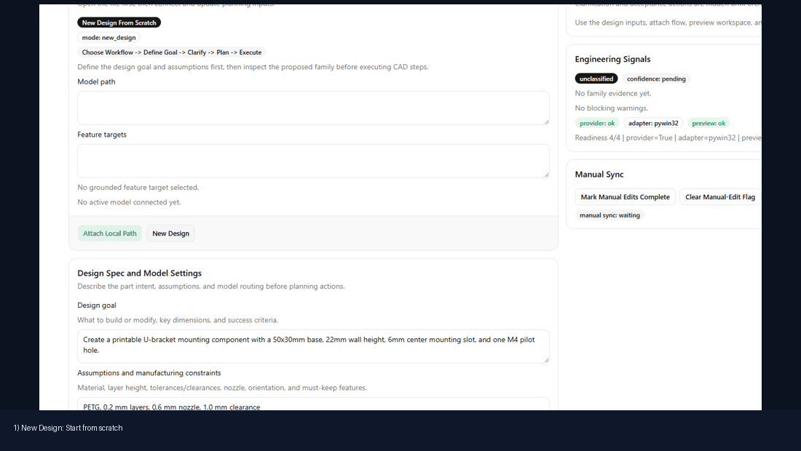

# Tutorial Tracks

Build SolidWorks parts and assemblies from scratch using the MCP server and Prefab UI.

## Track A: Script-Based Part Generation

Best for automated, reproducible builds with direct Python scripting.

**Example:** Use Python scripts to call MCP tools directly and build parts from sketch definitions.

```powershell
.\.venv\Scripts\python.exe docs/getting-started/tutorials/build_u_bracket_from_scratch.py
```

**Advantages:**
- Fast, deterministic output
- Repeatable across runs
- Full control over feature sequence
- Easy to version-control and share

**Best for:** CI/CD pipelines, automated testing, generating baseline artifacts

---

## Track B: UI-Assisted Prompt Workflow

Best for human-in-the-loop design with visual checkpoints and interactive refinement.



### Setup (one time)

1. Start the MCP server:

```powershell
.\.venv\Scripts\python.exe -m solidworks_mcp.server
```

2. Start the Prefab UI backend (Terminal 1):

```powershell
.\.venv\Scripts\python.exe -m uvicorn solidworks_mcp.ui.server:app --host 127.0.0.1 --port 8766
```

3. Start the Prefab UI frontend (Terminal 2):

```powershell
.\.venv\Scripts\prefab.exe serve src/solidworks_mcp/ui/prefab_dashboard.py
```

4. Open browser: `http://127.0.0.1:5175`

### Workflow

1. **New Design** → Click to start blank session
2. **Enter intent** → Describe what you want to build (goal + assumptions)
3. **Approve brief** → LLM classifies design family and suggests approach
4. **Inspect & plan** → Review model context and feature tree
5. **Execute & refine** → Run checkpoint tool calls, review evidence
6. **Refresh 3D** → View isometric/orthographic previews in real-time
7. **Manual sync** → Detect and approve manual edits if needed

**Advantages:**
- Visual feedback at every step
- Edit and iterate interactively
- Capture evidence for design review
- Easy to explain to team members

**Best for:** Learning, design exploration, team collaboration, design documentation

---

## Track C: Hybrid Workflow (UI + Script + Direct Prompting)

Combine UI for planning, scripts for part generation, and direct prompting for refinement.

1. Use **Track B UI** to write and refine prompts interactively
2. Export proven prompts as **Track A scripts**
3. Use prompts directly in Claude/ChatGPT if MCP server unavailable

**Best for:** Production workflows, cross-team collaboration, knowledge capture

---

## Choosing Your Track

| Goal | Track | Reason |
|------|-------|--------|
| Learn the workflow | B (UI) | Visual feedback and real-time 3D |
| Build a baseline | A (Script) | Fast, repeatable, CI-ready |
| Share with team | C (Hybrid) | Prompts + UI for explanation |
| One-shot creation | B (UI) | Interactive refinement |
| Bulk generation | A (Script) | Automation, minimal overhead |

---

## Available Tutorials

### From-Scratch Part Building

- **[U-Joint Assembly Tutorial](tutorials/u-joint-assembly-build.md)** — Build a complete mechanical drive assembly (8 parts + assembly) from scratch using Prompts and UI checkpoints

### Guided Prompt Packs

- **[U-Joint Rebuild Prompts](tutorial-parts/u_joint_rebuild_prompt.md)** — Pre-written prompts for rebuilding the U-joint if you already have reference samples

---

## Getting Started

Choose your track and open the corresponding tutorial:

- **Track A:** Look for `build_*.py` scripts in `docs/getting-started/tutorials/`
- **Track B:** Open [U-Joint Assembly Tutorial](tutorials/u-joint-assembly-build.md) and start the Prefab UI
- **Track C:** Follow both A and B in parallel

**First time?** Start with **Track B** (UI-Assisted) — it will teach you the MCP workflow and tool capabilities interactively.
