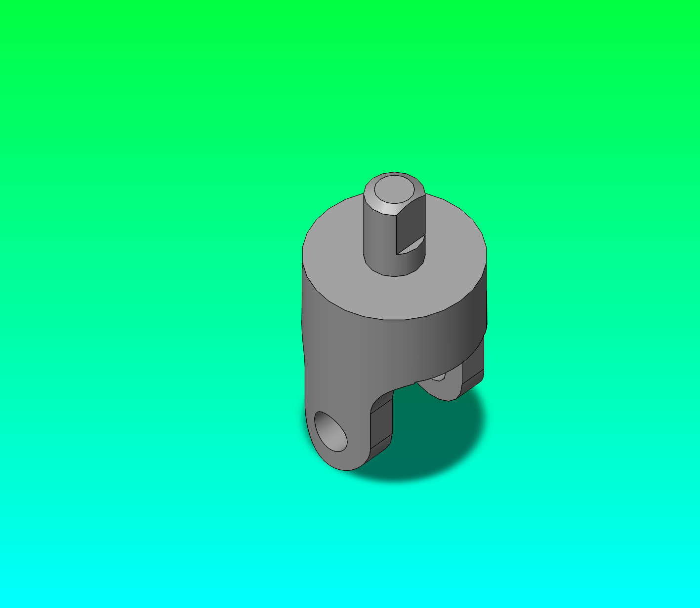

# U-Joint Assembly: Build from Scratch Tutorial

⚠️ **UNDER CONSTRUCTION** ⚠️
This tutorial is still in development and will be updated with new information and changes. Please check back regularly for updates.


Build a complete mechanical U-joint assembly using Claude Code and the SolidWorks MCP server. This tutorial walks through creating each part from empty files, validating geometry, and assembling components into a fully functional joint.

**Target:** `C:\Users\Public\Documents\SOLIDWORKS\SOLIDWORKS 2026\samples\learn\U-Joint\UJoint.SLDASM`

**Parts to build:**

- Yoke_male
- Yoke_female  
- Spider (cross)
- Pin
- Crank_shaft
- Crank_arm
- Crank_knob
- Bracket (mounting)

## Prerequisites

- SolidWorks 2019+ installed and launched at least once
- MCP server running: `.\.venv\Scripts\python.exe -m solidworks_mcp.server`
- MCP server connected (see [SolidWorks as Code](../solidworks-as-code.md) for session setup)
- **No pre-made parts** — you will create everything from scratch

## Phase 1: Setup and Part Planning

### Step 1: Start the MCP Server

Run the MCP server with the `--real` flag to connect to your running SolidWorks instance:

```powershell
.\run-mcp.ps1 --real --year 2026
```

Or configure `.mcp.json` to launch it automatically — see [SolidWorks as Code](../solidworks-as-code.md) for session setup details.

### Step 2: Verify Connection

Ask Claude Code to confirm the server is live:

```
What is the currently active SolidWorks model?
```

Expected: model info for the active document, or `No active model` if SolidWorks is open without a file.

### Step 3: Plan Build Order

The U-joint has 8 parts. Build in this order to respect mate dependencies:

| # | Part | Role |
| --- | --- | --- |
| 1 | Bracket | Fixed base — all others mount to it |
| 2 | Yoke_male | Drive shaft end |
| 3 | Yoke_female | Output shaft end |
| 4 | Spider | Cross hub linking both yokes |
| 5 | Pin ×4 | Spider-to-yoke arm connectors |
| 6 | Crank_shaft | Main drive shaft |
| 7 | Crank_arm | Lever arm |
| 8 | Crank_knob | Grip handle |

### Step 4: Get Part Specifications

**Prompt Claude Code to get part specifications:**

```
Analyze the U-joint assembly structure and provide a build order 
and critical dimensions for each part:
- Part name
- Feature plan (sketch → extrude → refinements)
- Critical dimensions
- Mating interfaces (holes, bores, surfaces)
- Print orientation preference (if 3D-printed variant)

Focus on:
1. Yoke_male: rectangular outer profile, center bore for pin, drive flange connection
2. Yoke_female: same profile, accepts male yoke and spider
3. Spider: cross-shaped central hub, four bores for pins
4. Pin: ∅6mm shaft, length to bridge yoke pair
5. Crank_shaft: long drive shaft with yoke flange at one end
6. Crank_arm: lever arm for manual actuation
7. Crank_knob: grip handle at end of arm
8. Bracket: mounting base to attach assembly to frame
```

**Expected output:** Ordered build sequence and part-by-part geometry rules.

## Phase 2: Build Individual Parts

### Prompt Template for Each Part

For each part, use this template with Claude Code:

```
**Part: [NAME]**

Create a new SolidWorks part named [NAME].SLDPRT with:

Feature plan:
- [Sketch1]: [profile description]
- [BaseExtrude]: [extrusion depth and direction]
- [Sketch2]: [holes/refinements]
- [RefineFeature]: [any additional details]

Critical dimensions:
- [DIM1]: [value with tolerance]
- [DIM2]: [value with tolerance]
- [DIM3]: [value with tolerance]

Mating interfaces:
- [HOLE/BORE]: diameter [value], location [reference]
- [SURFACE]: face reference for assembly mate

Rules:
- Save to docs/getting-started/tutorials/parts/[NAME].SLDPRT
- Validate geometry before export
- Export isometric PNG as [NAME]_isometric.png
- Report final feature tree order
```

### Part 1: Bracket (Exact Sample Match)

**SolidWorks-as-Code script:** `docs/getting-started/tutorial-parts/build_u_bracket_artifact.py`

**Prompt Claude Code:**

```
Build Bracket.SLDPRT from scratch and match the U-Joint sample bracket exactly.

Ensure all sketches are properly dimensioned using the 
Reference model:
- C:\Users\Public\Documents\SOLIDWORKS\SOLIDWORKS 2026\samples\learn\U-Joint\bracket.sldprt

Use mm units and keep this exact feature order:
1. Sketch1
2. Base-Extrude-Thin
3. Sketch2
4. Cut-Extrude1

Sketch1 on Front Plane (connected lines in this order):
- (0.00, 0.00) -> (0.00, 82.55)
- (0.00, 82.55) -> (-57.15, 82.55)
- (-57.15, 82.55) -> (-77.216, 27.494)
- (-77.216, 27.494) -> (-44.45, 0.00)

Base-Extrude-Thin settings:
- Mid-plane depth: 38.10
- Thin-wall thickness: 6.35
- Auto-fillet corners: ON
- Corner radius: 3.175

Sketch2 on top planar face (offset from Top Plane at 88.90 if face selection is unstable):
- Centerline: (0.00, 0.00) -> (-57.15, 0.00)
- Hole circle center: (-44.45, 0.00)
- Hole diameter: 12.70

Cut-Extrude1:
- Blind depth: 10.00

Export isometric PNG to validate geometry before proceeding.
```

**Validation checklist:**

- [ ] Sketch1 coordinates match the listed points
- [ ] Base-Extrude-Thin uses 38.10 depth and 6.35 wall thickness
- [ ] Sketch2 hole center and diameter match exactly
- [ ] Cut-Extrude1 depth is 10.00
- [ ] Feature tree is exactly Sketch1 -> Base-Extrude-Thin -> Sketch2 -> Cut-Extrude1
- [ ] Isometric PNG captured and saved
- [ ] Isometric PNG visually matches the sample bracket

### Part 2: Yoke_male



**SolidWorks-as-Code script:** `docs/getting-started/tutorial-parts/build_yoke_male_artifact.py`

Run it directly against a live SolidWorks session:

```powershell
.\.venv\Scripts\python.exe docs/getting-started/tutorial-parts/build_yoke_male_artifact.py
```

**Checkpoint script (base + U-slot only):** `docs/getting-started/tutorial-parts/build_yoke_male_checkpoint2.py`

**Prompt Claude Code:**

```
Build Yoke_male.SLDPRT to match the SW 2026 sample at
C:\Users\Public\Documents\SOLIDWORKS\SOLIDWORKS 2026\samples\learn\U-Joint\Yoke_male.sldprt

Geometry (all dims in mm):
- Base cylinder: ∅38.10 (r=19.050), height=47.625, extruded from Top plane upward
- U-slot cut: closed profile on Front plane — 5 lines + 3 arcs (R=9.525 each)
    outer rect X=±19.050, Y=-1.366 to 29.210; inner walls at X=±9.525
    arm tip arcs centred at (±19.050, 19.685); U-bottom arc centred at (0, 9.525)
    through-all in both Z directions
- Arm gap: rectangular slot on Right plane — Z=±10.160, Y=-7.455 to 29.145
    through-all in X (creates the two fork arms)
- Pin bore: ∅9.525 (r=4.7625) circle on Front plane at (0, 9.525), through-all in Z
- Stub shaft: ∅12.70 (r=6.350) circle on Top plane, extruded 66.675mm total
- Stub bore: ∅12.70 circle on Top plane, through-all cut (removes core of stub shaft)

Feature sequence:
1. Sketch1 → Top plane: circle r=19.050
2. Boss-Extrude1: 47.625mm
3. Sketch2 → Front plane: 5-line + 3-arc closed U-slot profile (add radial dims R=9.525)
4. Cut-Extrude1: through-all both directions
5. Sketch8 → Right plane: rectangle Z=±10.160, Y=-7.455..29.145
6. Cut-Extrude2: through-all both directions
7. Sketch11 → Front plane: circle r=4.7625 at (0, 9.525)
8. Cut-Extrude3: through-all both directions
9. Sketch12 → Top plane: circle r=6.350
10. Boss-Extrude2: 66.675mm
11. Sketch13 → Top plane: circle r=6.350
12. Cut-Extrude4: through-all

Export isometric PNG to docs/getting-started/tutorial-parts/yoke_male_from_prompt_isometric.png
```

**Validation checklist:**

- [ ] Base cylinder ∅38.10mm × 47.625mm tall
- [ ] U-slot cut: arm inner width = 19.050mm, arm tip radius = 9.525mm
- [ ] Arm gap: 20.320mm wide (Z=±10.160), exposes both fork arms
- [ ] Pin bore ∅9.525mm centred at Y=9.525mm (arm mid-height)
- [ ] Stub shaft ∅12.70mm extending to Y=66.675mm
- [ ] Stub bore ∅12.70mm cut through stub
- [ ] Isometric PNG visually matches answer key

### Part 3: Yoke_female

**SolidWorks-as-Code script:** `docs/getting-started/tutorial-parts/build_yoke_female_artifact.py`

Run it directly against a live SolidWorks session:

```powershell
.\.venv\Scripts\python.exe docs/getting-started/tutorial-parts/build_yoke_female_artifact.py
```

**Prompt Claude Code:**

```
Build Yoke_female.SLDPRT to match the SW 2026 sample at
C:\Users\Public\Documents\SOLIDWORKS\SOLIDWORKS 2026\samples\learn\U-Joint\Yoke_female.sldprt

Yoke_female shares the same cylinder+fork body as Yoke_male but has a
through-bore (no stub shaft) so it slides onto the driven shaft.

Geometry (all dims in mm):
- Base cylinder: ∅38.10 (r=19.050), height=47.625, extruded from Top plane upward
- U-slot cut: identical profile to Yoke_male (Front plane, 5 lines + 3 arcs R=9.525)
    outer rect X=±19.050, Y=-1.366 to 29.210; inner walls X=±9.525; through-all Z
- Arm gap: Right plane, Z=±10.160, Y=-7.455 to 29.145, through-all X
- Pin bore: ∅9.525 (r=4.7625) on Front plane at (0, 9.525), through-all Z
- Shaft through-bore: ∅12.70 circle on Top plane, through-all (no stub shaft added)

Feature sequence:
1. Sketch1 → Top plane: circle r=19.050
2. Boss-Extrude1: 47.625mm
3. Sketch2 → Front plane: 5-line + 3-arc U-slot (radial dims R=9.525)
4. Cut-Extrude1: through-all both directions
5. Sketch8 → Right plane: rectangle Z=±10.160, Y=-7.455..29.145
6. Cut-Extrude2: through-all both directions
7. Sketch11 → Front plane: circle r=4.7625 at (0, 9.525)
8. Cut-Extrude3: through-all both directions
9. Sketch12 → Top plane: circle r=6.350
10. Cut-Extrude4: through-all (shaft through-bore, no extrusion)

Export isometric PNG to docs/getting-started/tutorial-parts/yoke_female_from_prompt_isometric.png
```

**Validation checklist:**

- [ ] Base cylinder ∅38.10mm × 47.625mm tall
- [ ] U-slot cut matches Yoke_male (arm tip R=9.525mm)
- [ ] Arm gap 20.320mm wide (Z=±10.160)
- [ ] Pin bore ∅9.525mm at Y=9.525mm
- [ ] Shaft through-bore ∅12.70mm (no stub shaft protrusion)

### Part 4: Spider (Cross Hub)

**Prompt Claude Code:**

```
Build Spider.SLDPRT from scratch.

Geometry:
- Center cube: 12mm x 12mm x 12mm
- Four radial arms extending from cube faces: each 50mm long, 8mm x 8mm cross-section
- Four clearance bores: ∅6.2mm diameter, one at end of each arm
- Center boss: ∅6mm + 2mm height, on cube top for pin alignment

Feature sequence:
1. Sketch1: center cube 12x12x12mm
2. BaseExtrude: extrude 12mm
3. Sketch2: four arm profiles (cross profile 8x8mm at four faces)
4. ArmExtrudes: extrude each 50mm radially
5. Sketch3: four ∅6.2mm bore locations on arm ends
6. ArmBores: cut extrude 6mm depth on each arm
7. Sketch4: ∅6mm center boss top
8. CenterBoss: extrude 2mm up on cube top
9. FilletEdges: 0.5mm fillet on arm transitions

Export isometric PNG.
```

**Validation checklist:**

- [ ] Center cube 12 x 12 x 12 mm
- [ ] Four arms 50mm long, 8mm x 8mm
- [ ] Four bores ∅6.2mm at arm ends
- [ ] Center boss ∅6mm x 2mm on top
- [ ] All fillets applied
- [ ] Feature tree matches sequence

### Part 5: Pin

**Prompt Claude Code:**

```
Build Pin.SLDPRT from scratch.

Geometry:
- Cylindrical shaft: ∅6mm diameter, 40mm length
- Head flange: ∅12mm diameter, 2mm thick, at one end
- Retaining groove (optional): 0.5mm deep around shaft at 5mm from head

Feature sequence:
1. Sketch1: ∅6mm circle on XY plane
2. ShaftExtrude: extrude 40mm along Z
3. Sketch2: ∅12mm circle at one end
4. HeadExtrude: extrude 2mm (head flange)
5. FilletShaft: 0.5mm fillet where head meets shaft

Export isometric PNG.
```

**Validation checklist:**

- [ ] Shaft ∅6mm x 40mm length
- [ ] Head flange ∅12mm x 2mm
- [ ] Fillet at shaft-head junction
- [ ] Feature tree correct

### Part 6: Crank_shaft

**Prompt Claude Code:**

```
Build Crank_shaft.SLDPRT from scratch.

Geometry:
- Main drive shaft: ∅10mm diameter, 120mm length
- Yoke mounting flange at one end: ∅40mm diameter, 5mm thick
- Four clearance holes on flange (M4): arranged in ∅30mm circle
- Center bore through flange: ∅10mm (for main shaft)

Feature sequence:
1. Sketch1: ∅10mm circle
2. ShaftExtrude: extrude 120mm
3. Sketch2: ∅40mm circle at one end
4. FlangeExtrude: extrude 5mm
5. Sketch3: center ∅10mm bore on flange
6. CenterBore: cut extrude through flange
7. Sketch4: four ∅4.2mm holes on ∅30mm circle
8. FlangeHoles: cut extrude through flange

Export isometric PNG.
```

**Validation checklist:**

- [ ] Shaft ∅10mm x 120mm
- [ ] Flange ∅40mm x 5mm
- [ ] Center bore ∅10mm through flange
- [ ] Four M4 holes on flange

### Part 7: Crank_arm

**Prompt Claude Code:**

```
Build Crank_arm.SLDPRT from scratch.

Geometry:
- Base pad: 60mm long, 12mm wide, 8mm tall
- Connection to crank_shaft: top end has ∅10mm bore
- Grip section at bottom: 30mm x 12mm x 20mm tall
- Two corner fillets: 2mm radius on grip edges

Feature sequence:
1. Sketch1: 60mm x 12mm rectangle
2. BaseExtrude: extrude 8mm
3. Sketch2: ∅10mm bore at top end
4. ShaftBore: cut extrude through thickness
5. Sketch3: grip section 30x12x20mm on base
6. GripExtrude: extrude 20mm up
7. FilletGrip: 2mm fillet on grip edges

Export isometric PNG.
```

**Validation checklist:**

- [ ] Arm 60mm long, 12mm wide
- [ ] Shaft bore ∅10mm at connection end
- [ ] Grip section 30 x 12 x 20 mm

### Part 8: Crank_knob

**Prompt Claude Code:**

```
Build Crank_knob.SLDPRT from scratch.

Geometry:
- Main knob: ∅25mm sphere or rounded cube (choose sphere for simplicity)
- Connection post: ∅6mm diameter, 15mm height
- Base flange: ∅10mm diameter, 3mm thick (on connection post bottom)

Feature sequence:
1. Sketch1: ∅25mm circle on XY plane (if using sphere)
2. KnobRevolved: revolve 180° around XY to create sphere
   OR KnobExtrude: extrude ∅25mm cylinder 25mm if using rounded cube
3. Sketch2: ∅6mm circle on bottom face
4. PostExtrude: extrude 15mm down
5. Sketch3: ∅10mm circle at post bottom
6. FlangeExtrude: extrude 3mm down
7. FilletAll: 1mm fillet on all edges

Export isometric PNG.
```

**Validation checklist:**

- [ ] Knob ∅25mm round shape
- [ ] Connection post ∅6mm x 15mm
- [ ] Flange ∅10mm x 3mm at base
- [ ] All edges filleted

## Phase 3: Assembly Build

### Prompt: Build UJoint Assembly

```
Create assembly UJoint.SLDASM from scratch.

Parts to insert:
1. Bracket.SLDPRT - fixed/grounded base
2. Crank_shaft.SLDPRT - insert into Bracket boss
3. Yoke_male.SLDPRT - attach to crank_shaft flange
4. Yoke_female.SLDPRT - position parallel to yoke_male
5. Spider.SLDPRT - insert between yokes
6. Pin.SLDPRT (qty 4) - connect spider to yokes
7. Crank_arm.SLDPRT - attach to crank_shaft free end
8. Crank_knob.SLDPRT - attach to crank_arm grip

Assembly rules:
- Ground Bracket to origin
- Concentric mate: crank_shaft bore to bracket M8 boss
- Coincident mate: yoke_male flange to crank_shaft flange (coplanar)
- Concentric mate: spider center bore to yoke_male center bore
- Concentric mate: spider to yoke_female center bore
- Pin mates: four pins bridge yoke arms to spider arm bores (concentric)
- Concentric mate: crank_arm bore to crank_shaft free end
- Concentric mate: crank_knob to crank_arm grip section

Validation:
- Report total mate count
- Confirm assembly is fully defined (all DOFs constrained)
- No interference detected between parts
- Joints rotate smoothly (simulated or inspected)
- Export isometric PNG of full assembly

Export:
- Save as UJoint.SLDASM
- Export assembly isometric PNG
```

**Validation checklist:**

- [ ] All 8 parts inserted
- [ ] Assembly fully defined
- [ ] No interference warnings
- [ ] Rotational joints move freely
- [ ] Final assembly PNG captured

## Phase 4: Validation and Export

### Prompt: Final Assembly Validation

```
Perform final validation of UJoint.SLDASM:

Checklist:
- [ ] All 8 parts present in assembly tree
- [ ] All mates are coincident/concentric (no over-constraints)
- [ ] Assembly rebuild succeeds without errors
- [ ] No interference between components
- [ ] Crank_shaft rotates 360° freely
- [ ] Spider rotates 360° between yokes
- [ ] Pin connections are rigid
- [ ] Bracket is fixed to origin
- [ ] All parts have correct feature trees (no extra/missing features)

Generate report:
- Assembly statistics (part count, mate count)
- Feature tree for each part
- Mass properties if material assignments available
- Export images: isometric view from three angles (0°, 45°, 90°)
- Final pass/fail verdict with any corrective actions needed
```

## Troubleshooting

**Issue:** Part bore diameter too large, pin moves freely

→ Re-run Prompt for that part, specify bore tolerance -0.1mm (tight fit)

**Issue:** Assembly fully constrained but components don't articulate

→ Check mate types; replace coincident with concentric on rotation axes

**Issue:** Feature tree has extra sketches or features

→ Re-run part build prompt, emphasize "only use features in this exact sequence"

## Next Steps

After completing this tutorial:

- Export each part and assembly to STL for 3D printing (if needed)
- Modify dimensions for your application (bearing sizes, flange spacing, etc.)
- Add material properties and compute mass
- Use the assembly as a template for other drive mechanisms

---

**Related docs:**

- [SolidWorks as Code](../solidworks-as-code.md)
- [Tool Catalog](../../user-guide/tool-catalog/index.md)
- [Integration Testing](../../user-guide/integration-testing.md)
