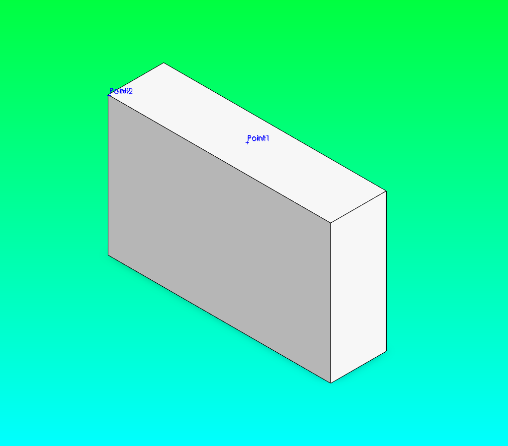
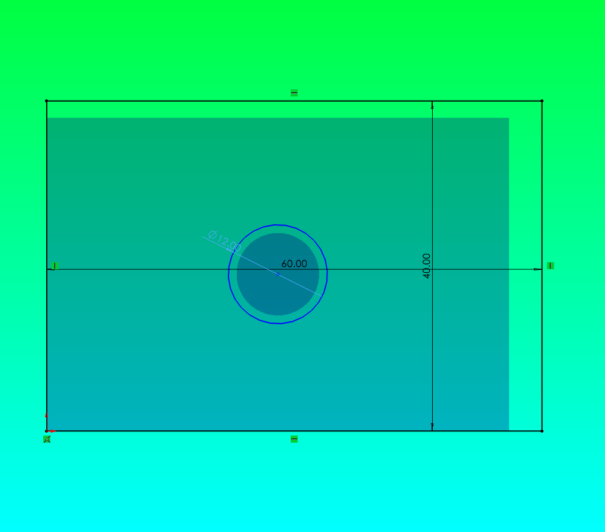
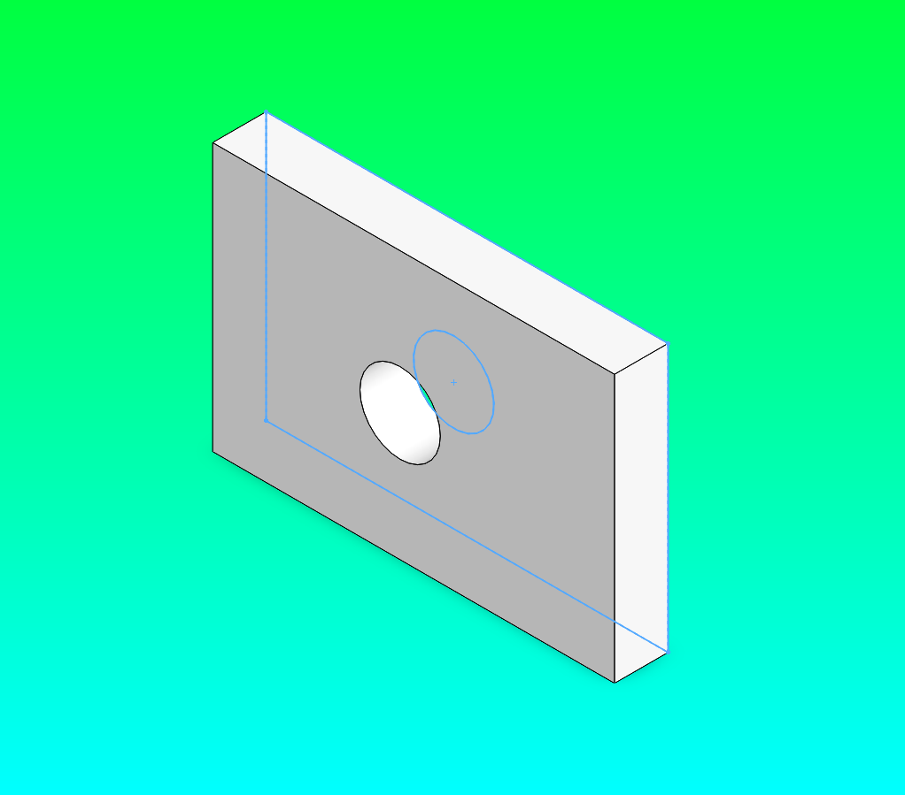
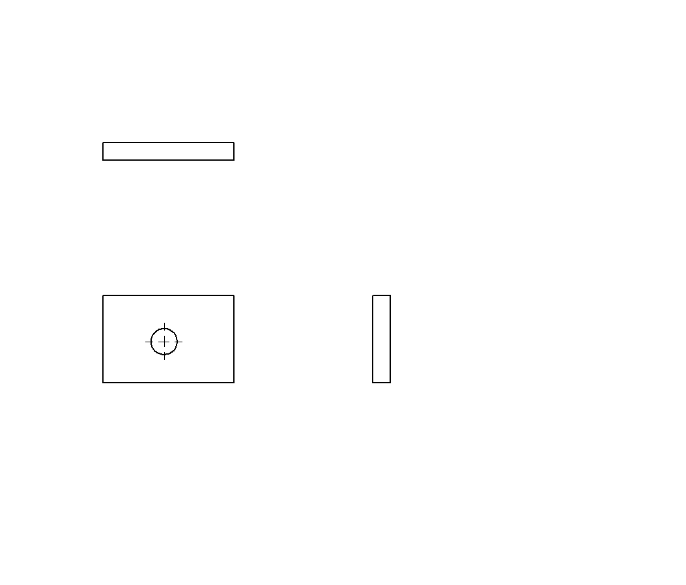

# Prompt-Driven Walkthrough: Smart Dimensions, Reference Points, Save Bodies & Center Marks

This tutorial reproduces a live session that was run end-to-end against
**SolidWorks 3DEXPERIENCE R2026x** through the MCP server. Every screenshot on
this page was captured with the `export_image` tool during that run — nothing is
mocked.

It covers four capabilities, three of them added in **v1.2.0**:

| Tool | What it does | Added |
|---|---|---|
| `add_sketch_dimension` | Drives a rough sketch to exact size (linear + diameter) | earlier |
| `create_reference_point` | Reference point on an edge (`along_curve`) or face centroid (`face_center`) | 1.2.0 |
| `save_body_as_part` | Extracts one solid body of a multibody part to a standalone `.sldprt` | 1.2.0 |
| `auto_center_marks` | Runs SolidWorks' automatic centre-mark insertion on a drawing view | 1.2.0 |

You drive the whole thing with **plain-language prompts** — the exact text is in
each section. The assistant translates each prompt into the MCP tool calls shown
underneath it.

---

## What you need

- SolidWorks running, COM-accessible, **no documents open**.
- The `solidworks-mcp` server connected to your MCP client (Claude Code / Claude
  Desktop / VS Code). If you just restarted SolidWorks, reconnect the server
  first — a stale COM handle causes `No part template configured` /
  `No active model` errors (the `CLAUDE.md` troubleshooting runbook at the repo
  root covers this as "stale COM handle").
- A scratch folder that already exists, e.g. `C:\Temp\wave3_demo\`. The tools
  **do not create** the parent directory — `save_body_as_part` refuses a missing
  one on purpose.

!!! tip "One instruction that saves you a support ticket"
    Put **"stop and show me the tool call and error if anything fails"** in every
    prompt. The tools return structured `status` / `message` payloads; surfacing
    them verbatim is how you debug a live CAD session.

---

## Scenario A — Smart-dimensioned bracket → reference points → save body

### Step A1 — Build a bracket from a rough sketch, then smart-dimension it

The point of this step: you sketch **approximately**, then let dimensions snap the
geometry to the real numbers. That is how a parametric sketch is meant to be
built.

**Prompt:**

```text
Create a new part in mm. On the Front plane, sketch a rectangle roughly
76 x 46 mm using four lines starting at the origin. Then add smart sketch
dimensions to drive it to exactly 80 mm wide and 50 mm tall. Exit the sketch
and extrude it 20 mm. Show me each tool call and its result. Stop on any error.
```

**Tool calls the assistant makes:**

| # | Tool | Key arguments | Result |
|---|---|---|---|
| 1 | `create_part` | `name="Wave3Bracket", units="mm"` | `Part45` |
| 2 | `create_sketch` | `plane="Front"` | `Sketch1` |
| 3 | `add_line` ×4 | `(0,0)->(76,0)`, `(76,0)->(76,46)`, `(76,46)->(0,46)`, `(0,46)->(0,0)` | `Line_1 … Line_4` |
| 4 | `add_sketch_dimension` | `entity1="Line_1", dimension_type="linear", value=80` | `Dimension_5` — *"Added linear dimension of 80.0mm to Line_1"* |
| 5 | `add_sketch_dimension` | `entity1="Line_2", dimension_type="linear", value=50` | `Dimension_6` — *"…50.0mm to Line_2"* |
| 6 | `exit_sketch` | — | ok |
| 7 | `create_extrusion` | `sketch_name="Sketch1", depth=20` | `Boss-Extrude1` |

!!! warning "`add_sketch_dimension` only accepts entity IDs from line/arc/circle/spline/centerline"
    It **cannot** dimension a `Rectangle_1` returned by `add_rectangle` — that tool
    hands back one ID for the whole rectangle, not its four edges. Build
    dimensionable rectangles with four `add_line` calls so you get
    `Line_1 … Line_4` back. Linear values are millimetres; angular values are
    degrees.


### Step A2 — Add two reference points

`create_reference_point` has two modes. Both resolve their location with a
**coordinate pick**, so the `(x, y, z)` you give in millimetres must actually lie
on the target edge or face.

**Prompt:**

```text
On this bracket, add a reference point at the centre of the top face
(the face at y = 50), and another at the midpoint of the top-back edge.
Use face_center mode for the first and along_curve at 50 percent for the
second. Report the feature count before and after each.
```

**Tool calls:**

| # | Tool | Key arguments | Result |
|---|---|---|---|
| 1 | `create_reference_point` | `mode="face_center", x=40, y=50, z=10` | *"Created a reference point at a face centre"* — features 19 → 20 |
| 2 | `create_reference_point` | `mode="along_curve", x=40, y=50, z=20, percent=50` | *"Created a reference point at 50.0% along a curve"* — features 20 → 21 |

`along_curve` also takes `distance` (mm from the edge start) **instead of**
`percent` — give exactly one. `InsertReferencePoint` always returns a feature, so
the tool confirms success by the feature tree growing, not by the API return.

!!! danger "Origin-plane picks fail on SolidWorks 2026"
    A coordinate pick where `x = 0` **or** `z = 0` resolves the *reference plane*
    at the origin instead of your edge/face, and the tool reports
    *"No edge/face found at …"*. That is why the prompt targets the top face at
    `y = 50` and an edge at `z = 20` — both clear of the origin planes. Pick a
    coordinate a few millimetres off any origin plane.



### Step A3 — Extract the body to its own part

**Prompt:**

```text
Save the solid body of this bracket to C:\Temp\wave3_demo\bracket_body.sldprt.
First try a body name I know is wrong ("NotARealBody") so I can see the error,
then use the real one.
```

**Tool calls:**

| # | Tool | Key arguments | Result |
|---|---|---|---|
| 1 | `save_body_as_part` | `body_name="NotARealBody", file_path="C:\Temp\wave3_demo\bracket_body.sldprt"` | **error** — *"Body 'NotARealBody' not found. Solid bodies: Boss-Extrude1"* |
| 2 | `save_body_as_part` | `body_name="Boss-Extrude1", file_path="C:\Temp\wave3_demo\bracket_body.sldprt"` | *"Saved body Boss-Extrude1 …"* — `feature="Save Bodies1"`, `solid_bodies=["Boss-Extrude1"]` |

The wrong-name call is not a trick — the response **always** lists every solid
body it found, so a bad guess tells you the real options. Success is confirmed by
the file existing on disk afterwards (here: a ~53 KB `.sldprt`).

!!! note "Save Bodies opens a linked assembly"
    SolidWorks' *Save Bodies* feature also creates and opens a linked assembly of
    the split bodies (standard behaviour — the "Create assembly" box). After the
    call you will have an extra `Assem…` document open. Close it without saving;
    add *"then close any assembly that Save Bodies opened"* to the prompt if you
    want the assistant to tidy up.


---

## Scenario B — Smart-dimensioned plate with a hole → drawing → centre marks

### Step B1 — Plate with a through hole, fully smart-dimensioned

**Prompt:**

```text
New part in mm. On the Front plane, draw a rough rectangle about 56 x 38 mm
from the origin with four lines, and a circle of radius 5 near the middle at
about (28, 19). Smart-dimension it: rectangle to 60 x 40 mm, and the circle to
a 12 mm diameter. Exit the sketch and extrude 8 mm so the circle leaves a
through hole. Then save it to C:\Temp\wave3_demo\plate.sldprt.
```

**Tool calls:**

| # | Tool | Key arguments | Result |
|---|---|---|---|
| 1 | `create_part` | `units="mm"` | `Part47` |
| 2 | `create_sketch` | `plane="Front"` | `Sketch1` |
| 3 | `add_line` ×4 | rough 56 × 38 rectangle | `Line_1 … Line_4` |
| 4 | `add_circle` | `center_x=28, center_y=19, radius=5` | `Circle_5` |
| 5 | `add_sketch_dimension` | `Line_1, linear, 60` | `Dimension_6` |
| 6 | `add_sketch_dimension` | `Line_2, linear, 40` | `Dimension_7` |
| 7 | `add_sketch_dimension` | `entity1="Circle_5", dimension_type="diameter", value=12` | `Dimension_8` — *"Added diameter dimension of 12.0mm to Circle_5"* |
| 8 | `exit_sketch` → `create_extrusion` | `depth=8` | `Boss-Extrude1` |
| 9 | `save_part` | `file_path="C:\Temp\wave3_demo\plate.sldprt"` | saved |

Putting the rectangle **and** the circle in one profile means a single
`create_extrusion` leaves a clean through hole — no cut feature needed.
(`create_cut` is not wired to live COM yet on this build.)

The `diameter` path uses SolidWorks' dedicated `AddDiameterDimension2` API, which
stays non-interactive — no *Modify* dialog. `radial` works the same way for a
radius.





### Step B2 — Make a drawing

**Prompt:**

```text
Create a drawing, then lay out the three standard views of
C:\Temp\wave3_demo\plate.sldprt on it at 1:1.
```

**Tool calls:**

| # | Tool | Key arguments | Result |
|---|---|---|---|
| 1 | `create_drawing` | `name="Wave3Plate2Drawing"` | `Draw13 - Sheet1` |
| 2 | `create_technical_drawing` | `model_file="C:\Temp\wave3_demo\plate.sldprt", auto_populate_views=true, scale="1:1"` | `["Drawing View1", "Drawing View2", "Drawing View3"]`, `projection="third_angle"` |

!!! warning "`create_technical_drawing` needs a drawing to already exist"
    It lays views onto the **active drawing sheet**; it does not create the
    document. Always `create_drawing` first, or you get
    *"requires a drawing document … Call create_drawing first"*.



### Step B3 — Auto-insert centre marks

**Prompt:**

```text
Run auto centre marks on Drawing View1 for holes and slots, and report the
before/after count. Then add a plain front view of the plate and run it on
that view too.
```

**Tool calls:**

| # | Tool | Key arguments | Result |
|---|---|---|---|
| 1 | `auto_center_marks` | `view_name="Drawing View1", mark_holes=true, mark_slots=true` | success — `center_marks_before=0`, `center_marks_after=0`, `center_marks_added=0` |
| 2 | `create_drawing_view` | `view_type="orthographic", orientation="front", position_x=320, position_y=120` | `Drawing View4` |
| 3 | `auto_center_marks` | `view_name="Drawing View4", …` | success — same `0 / 0 / 0` shape; the crosshair **is** inserted (see image) |


!!! note "Why the reported count is `0` even when a mark appears"
    `auto_center_marks` reads `IView::GetCenterMarkCount()` before and after and
    reports the delta, because `AutoInsertCenterMarks` returns no count of its
    own. On SolidWorks 3DEXPERIENCE R2026x that accessor returns `0` regardless
    of the marks actually present, so `center_marks_added` understates reality.
    **The tool's contract already treats `added: 0` as success** — "the view may
    have no un-marked holes". Trust the drawing, not the number, on this build
    (a count-readback fix is tracked in the issue tracker). On drawings whose
    template does **not** auto-insert marks on view creation, this tool is how
    you add them in bulk.

---

## Cleanup

**Prompt:**

```text
Close every open document without saving.
```

`close_model` acts on the **active** document. If several are open (part +
drawing, or a Save Bodies assembly), the assistant calls `activate_document`
then `close_model` per document, or loops `close_model` until
`list_open_documents` returns empty. Nothing in this tutorial writes to your real
work — the only files created are under your scratch folder.

---

## What is and isn't live today

| Capability | Live via MCP? |
|---|---|
| `add_sketch_dimension` — linear / radial / diameter / angular | ✅ |
| `create_reference_point` — `along_curve`, `face_center` | ✅ |
| `save_body_as_part` | ✅ (also opens a linked assembly) |
| `auto_center_marks` — insertion | ✅ (count read-back unreliable on R2026x) |
| `add_dimension` / `auto_dimension_view` — **drawing** dimensions | ❌ not wired to COM — sketch dimensions only |
| `create_cut` / `tutorial_simple_hole` | ❌ not wired to COM on this build |

---

## The tool docstrings (what the assistant sees)

### `create_reference_point`

> Create a reference point on the active part. Two modes: `along_curve` — a point
> on the edge under `(x, y, z)` mm, placed `distance` mm from the edge start, or
> at `percent` (0–100) of its length. Give exactly one of `distance` / `percent`.
> `face_center` — a point at the centroid of the face under `(x, y, z)` mm. The
> coordinate must lie on the target edge/face; SolidWorks resolves it with a
> coordinate pick. `InsertReferencePoint` always returns a feature, so success is
> confirmed by the feature tree growing.

### `save_body_as_part`

> Extract one solid body from the active multibody part to a new file. Runs
> SolidWorks' Save Bodies on a single named body, writing a standalone part to
> `file_path`. The body is matched by name against the active part's solid
> bodies; the response lists every solid body found, so an unknown name reports
> the real options. Success is confirmed by the file existing on disk afterwards.

### `auto_center_marks`

> Auto-insert centre marks on circular features in a drawing view. Runs
> SolidWorks' automatic centre-mark insertion for the named view. The API does
> not report how many marks it added, so the response gives the view's
> centre-mark count before and after and the delta. A run that added nothing is
> still a success — the view may have no un-marked holes.
