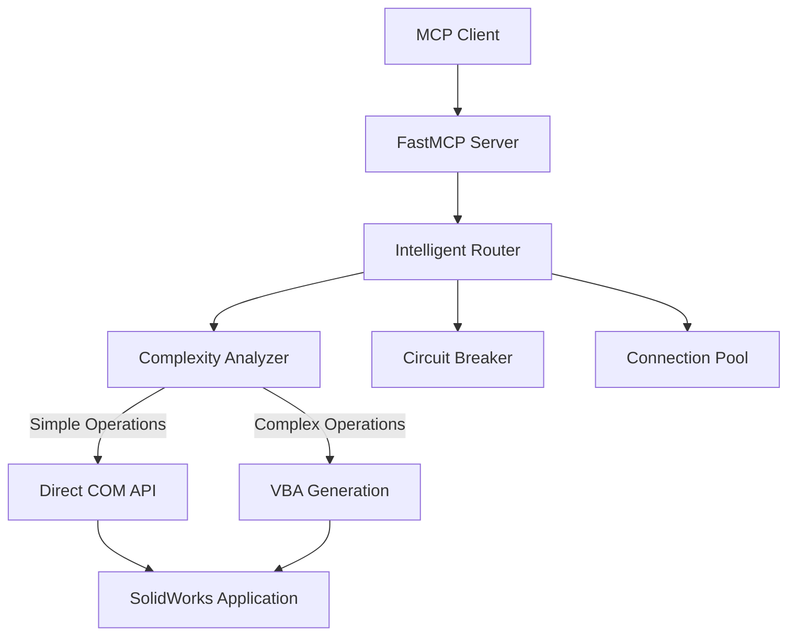

# SolidWorks MCP Server

[](https://www.python.org/downloads/)
[](https://modelcontextprotocol.io)
[](https://opensource.org/licenses/MIT)
[](https://www.microsoft.com/windows)
[](https://www.solidworks.com/)

**The Complete Python MCP Server for SolidWorks Automation**

🚀 **90+ Tools** | 🧠 **Intelligent Architecture** | ⚡ **Auto VBA Fallback** | 🔒 **Security-First**

## Overview

A comprehensive Model Context Protocol (MCP) server for SolidWorks automation, featuring intelligent COM/VBA routing, enterprise-grade security, and 90+ professional tools covering all aspects of CAD workflow automation.

## 🔥 Key Innovations

### Intelligent COM Bridge

Solves the traditional CAD automation challenge where COM interfaces fail with complex operations (13+ parameters):

- **Simple operations** → Direct COM API (fastest)
- **Complex operations** → Automatic VBA generation (reliable)  
- **Failed operations** → Circuit breaker fallback patterns

### Enterprise-Grade Security

Four-tier security model for different deployment scenarios:

- **Development** - Full access for local development
- **Restricted** - Controlled access for internal tools
- **Secure** - Production-ready with read-only operations
- **Locked** - Minimal access for public interfaces

## Quick Start

```bash
# Clone and setup
git clone https://github.com/yourusername/SolidworksMCP-python.git
cd SolidworksMCP-python

# Create conda environment and install
make install
mamba activate solidworks_mcp
uv pip install -e .[dev,test,docs]

# Run the server
python -m solidworks_mcp.server
```

## Tool Categories

| Category | Tools | Description |
|----------|-------|-------------|
| **Modeling** | 9 | Part creation, features, assemblies |
| **Sketching** | 17 | Complete sketching toolkit with constraints |
| **Drawing** | 8 | Drawing creation and management |
| **Drawing Analysis** | 10 | Quality analysis and compliance checking |
| **Analysis** | 4 | Mass properties, simulation, validation |
| **Export** | 7 | Multi-format export and conversion |
| **Automation** | 8 | Batch processing and workflows |
| **File Management** | 3 | File operations and organization |
| **VBA Generation** | 10 | Dynamic VBA code for complex operations |
| **Template Management** | 6 | Template creation and standardization |
| **Macro Recording** | 8 | Macro recording, optimization, and libraries |

## Architecture Overview

The SolidWorks MCP Server uses an intelligent adapter architecture that automatically routes operations between direct COM API calls and VBA macro generation based on complexity analysis:



## Getting Started

Ready to automate your SolidWorks workflows? Check out our comprehensive guides:

- [**Installation Guide**](getting-started/installation.md) - Set up your development environment
- [**Quick Start**](getting-started/quickstart.md) - Your first SolidWorks automation  
- [**Architecture Overview**](user-guide/architecture.md) - Understand the system design
- [**Tools Overview**](user-guide/tools-overview.md) - Explore all 90+ available tools

---

**Ready to get started?** → [Installation Guide](getting-started/installation.md)
