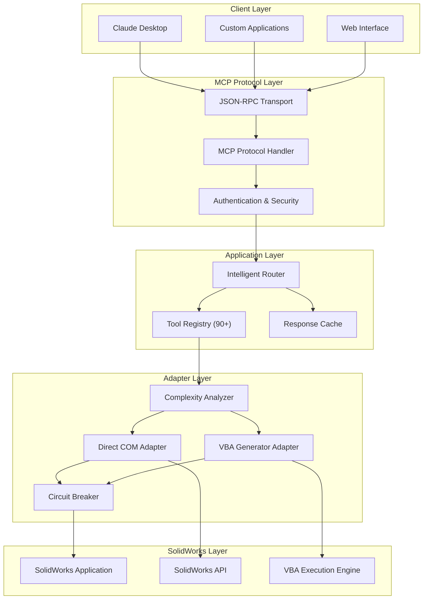
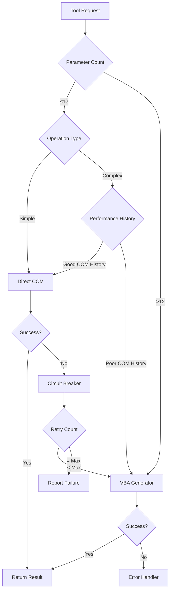
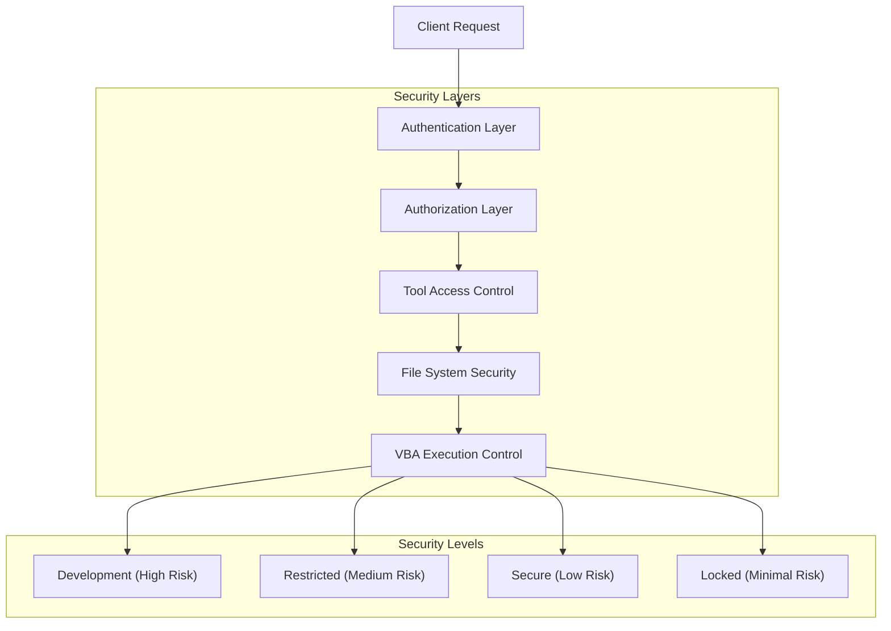
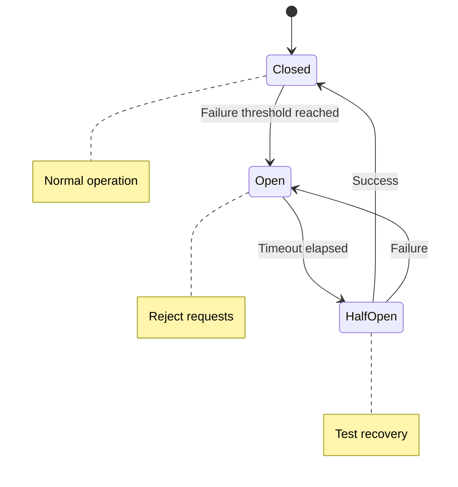
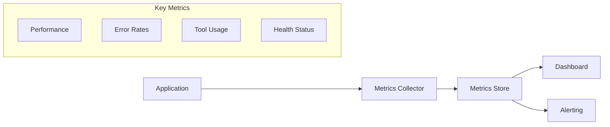

# Architecture Overview

The SolidWorks MCP Server implements an intelligent, multi-layered architecture designed to overcome the limitations of traditional COM-based SolidWorks automation while providing enterprise-grade reliability and security.

## High-Level Architecture

## Core Components

### 1. Intelligent Router

The core orchestrator that:

- **Route Selection**: Determines optimal execution path based on operation complexity
- **Load Balancing**: Distributes requests across available SolidWorks instances
- **Fallback Management**: Handles failures gracefully with automatic retry strategies
- **Caching**: Stores frequently accessed data to improve performance

### 2. Complexity Analyzer

Advanced analysis engine that examines operations to determine the best execution strategy:

#### Analysis Criteria

- **Parameter Count**: Operations with 13+ parameters typically require VBA
- **Operation Type**: Certain operations (sweeps, lofts) are VBA-preferred
- **Data Complexity**: Large datasets benefit from VBA batch processing
- **Performance History**: Past success/failure rates influence routing decisions

#### Decision Tree

### 3. Adapter Architecture

Dual-adapter system providing multiple execution paths:

#### Direct COM Adapter

- **Speed**: Fastest execution for simple operations
- **Reliability**: Direct API access with immediate feedback
- **Limitations**: Parameter count restrictions, complex operation failures
- **Use Cases**: Basic modeling, simple sketches, property queries

#### VBA Generator Adapter  

- **Flexibility**: Handles any operation complexity
- **Reliability**: Robust handling of complex parameter sets
- **Performance**: Optimized batch operations
- **Use Cases**: Complex features, batch processing, advanced operations

### 4. Security Architecture

Multi-layered security system with configurable protection levels:

#### Security Level Matrix

| Feature | Development | Restricted | Secure | Locked |
|---------|-------------|------------|--------|---------|
| Tool Access | All 90+ | Safe/Moderate | Read-only | Analysis only |
| File System | Full | Limited paths | Read-only | None |
| VBA Execution | Enabled | Controlled | Disabled | Disabled |
| Network Access | Enabled | Disabled | Disabled | Disabled |
| Authentication | None | API Key | OAuth2 | JWT |

### 5. Connection Management

Enterprise-grade connection handling:

#### Connection Pool

- **Instance Reuse**: Maintains pool of SolidWorks instances
- **Load Distribution**: Balances requests across instances  
- **Health Monitoring**: Tracks instance health and performance
- **Auto-scaling**: Adds/removes instances based on demand

#### Circuit Breaker Pattern

## Performance Optimizations

### Caching Strategy

#### Multi-Level Caching

1. **Result Cache**: Stores operation results for reuse
2. **Feature Cache**: Caches SolidWorks feature trees
3. **Property Cache**: Stores frequently accessed properties
4. **Query Cache**: Caches complex queries and analyses

#### Cache Invalidation

- **Time-based**: TTL expiration for dynamic data
- **Event-based**: Invalidation on model changes
- **Manual**: Explicit cache clearing commands

### Asynchronous Operations

#### Non-blocking Design

- **Async Tools**: All tools support asynchronous execution
- **Background Processing**: Long operations run in background
- **Progress Tracking**: Real-time progress for lengthy operations
- **Cancellation**: Ability to cancel in-progress operations

#### Batch Processing

- **Queue Management**: Smart queueing of batch operations
- **Resource Allocation**: Optimal resource utilization
- **Error Recovery**: Robust handling of batch failures
- **Progress Reporting**: Detailed batch progress tracking

## Error Handling

### Comprehensive Error Strategy

#### Error Classification

1. **Transient Errors**: Network, temporary SolidWorks issues
2. **Configuration Errors**: Invalid parameters, missing files
3. **System Errors**: SolidWorks crashes, COM failures
4. **Security Errors**: Access denied, authentication failures

#### Recovery Mechanisms

- **Automatic Retry**: Configurable retry with exponential backoff
- **Graceful Degradation**: Fallback to simpler operations
- **Health Checks**: Proactive system health monitoring
- **Alerting**: Configurable error notification system

## Monitoring and Observability

### Comprehensive Logging

- **Structured Logging**: JSON-formatted logs for analysis
- **Performance Metrics**: Operation timing and resource usage
- **Security Audit**: Complete audit trail of all operations
- **Health Metrics**: System health and performance indicators

### Metrics Collection

## Deployment Patterns

### Local Development

- Single instance with mock SolidWorks for testing
- Full debugging and development tool access
- Hot reloading for rapid development

### Enterprise Production

- Load-balanced multiple instances
- Database-backed caching and state management
- Comprehensive monitoring and alerting
- Security hardening and audit compliance

### Cloud Deployment

- Containerized instances with orchestration
- Auto-scaling based on demand
- Distributed caching and state management
- Global load balancing and CDN integration

---

!!! info "Next Steps"
    - Learn about [Tools Overview](tools-overview.md) to understand available capabilities
    - Check the [Getting Started Guide](../getting-started/quickstart.md) for practical examples
    - Review the codebase for technical implementation details
